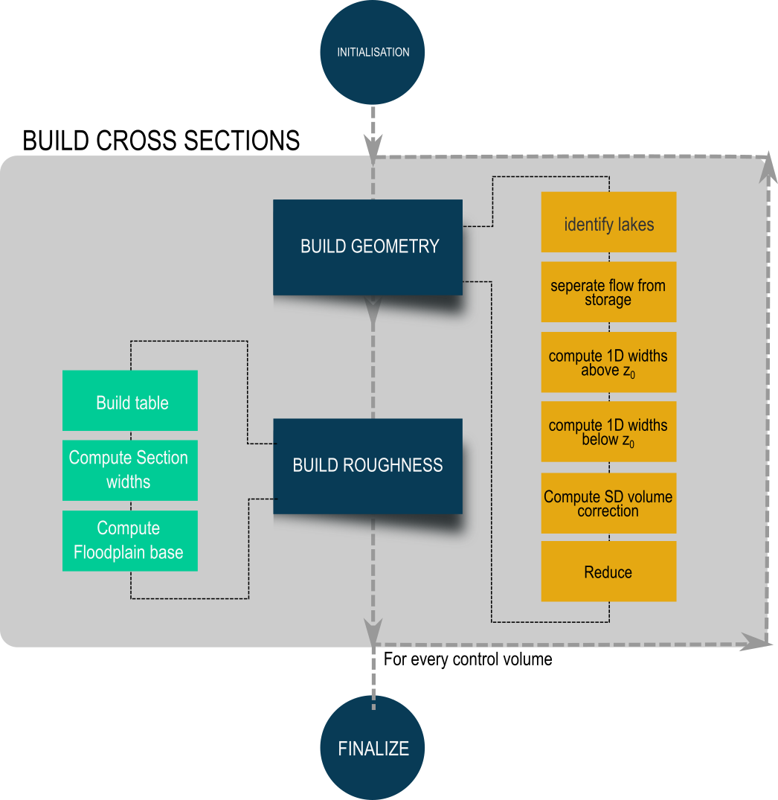

# Methodology

This chapter describes in more detail the steps FM2PROF takes to go from
a 2D representation of reality to a 1D representation of reality.
Conceptually, FM2PROF works in three distinct steps: (1) initialisation,
(2) building cross-sections and (3) finalisation.

## Initialisation

<figure markdown="span">
  { width="300" }
  <figcaption>Image caption</figcaption>
</figure>

The initialisation step involves parsing (i.e. reading and making
available for further analysis) the 2D data. In this step control
volumes and sections are defined as well. This step may take some time
to complete, but this preprocessing greatly reduces the computation
times in the next step.

### Import region file

The `Region`{.interpreted-text role="term"} file is specified in the
configuration file.

!!! warning

    For any reasonably sized river model, it is currently not advised to
    supply a polygon. Instead, a NetCDF file should be supplied. See
    `issue_region_polygon`{.interpreted-text role="ref"} for more
    information.

### Import section file

The `Section`{.interpreted-text role="term"} file is specified in the
configuration file.

!!! warning

    For any reasonably sized river model, it is currently not advised to
    supply a polygon. Instead, a NetCDF file should be supplied. See
    `issue_region_polygon`{.interpreted-text role="ref"} for more
    information.

### Import 2D data

#### Parsing 2D data {#section_parsing_2d_data}

Dflow2d uses a staggered grid to solve the (hydrostatic) flow equations.
Because of this staggered approach, there is not a single 2D point that
has all information. Flow information (flow velocity, discharge) is
stored in [flow links]{.title-ref}, while geometry (bed level) is stored
in cell faces. needs both information from the faces, as from the links.

<figure markdown="span">
  { width="300" }
  <figcaption>The dflow2d staggered grid.</figcaption>
</figure>

Below is a table that lists all variables read by from dflowd map
output.

  -----------------------------------------------------------------------
  FM2PROF variable                    Variable in dflow2d output
  ----------------------------------- -----------------------------------
  x (at face)                         mesh2d_face_x

  y (at face)                         mesh2d_face_y

  area (at face)                      mesh2d_flowelem_ba

  bedlevel (at face)                  mesh2d_flowelem_bl

  x (at flow link)                    mesh2d_edge_x

  y (at flow link)                    mesh2d_edge_y

  edge_faces (at flow link)           mesh2d_edge_faces

  edge_nodes (at flow link)           mesh2d_edge_nodes

  waterdepth                          mesh2d_waterdepth

  waterlevel                          mesh2d_s1

  chezy_mean                          mesh2d_czs

  chezy_edge                          mesh2d_czu

  velocity_x                          mesh2d_ucx

  velocity_y                          mesh2d_ucy

  velocity_edge                       mesh2d_u1
  -----------------------------------------------------------------------

  : Overview of variables from the 2D model that are used by FM2PROF

#### Classification of volumes

`Control volumes`{.interpreted-text role="term"} are used to define
which 2D datepoints are linked to which 1D cross-section. This is done
in the following steps:

-   Each node, link and face is assigned a `Region`{.interpreted-text
    role="term"}. This is currently done through DeltaShell (see
    `issue_region_polygon`{.interpreted-text role="ref"})
-   For each region seperately, a scikit-learn
    [KNearestNeighbour](https://scikit-learn.org/stable/modules/generated/sklearn.neighbors.KNeighborsClassifier.html)
    classifier is trained.
-   The classifier is used to uniquely identify each 2D link and each
    face to a 1D cross-section

#### Classification of sections

`Sections <Section>`{.interpreted-text role="term"} are used to output a
different roughness function for the main channel and the floodplains.
The purpose of the classification is to determine whether a 2D point
belongs to the main channel section, or to the floodplain section (see
warning below).

Two methods are implemented:

-   `Variance based classification<section_classification_variance>`{.interpreted-text
    role="ref"}
-   Polygon-based classification using DeltaShell (see
    `issue_region_polygon`{.interpreted-text role="ref"})

!!! warning

    If classification is done using DeltaShell, it is possible to define
    more than two sections. However, this functionality is not tested and
    may not work properly.

## Build Cross-Section

<figure markdown="span">
  { width="300" }
  <figcaption>The dflow2d staggered grid.</figcaption>
</figure>

Once initialisation is complete, will loop over each
`cross-section location<Cross-section location>`{.interpreted-text
role="term"}. In each iteration, the program takes two steps: (1)
building the geometry and (2) building the roughness tables.

!!! warning

    No cross-section will be generated for locations that have no 2D data
    assigned or have less than 10 faces assigned. This may happen if a
    location lies outside the 2D grid, or if there are many cross-section
    closely together. If this happens, an error is raised by FM2PROF. The
    user should check the cross-section location input file to resolve the
    problem.

### Build Geometry

In each loop, a number of steps is taken based on the 2D data that is
uniquely assigned to that cross-section:

-   `Lakes`{.interpreted-text role="term"} are identified using the
    `identify_lakes`{.interpreted-text role="ref"}
-   `Flow volume`{.interpreted-text role="term"} and
    `Storage volume`{.interpreted-text role="term"} are seperated using
    the `distinguish_storage`{.interpreted-text role="ref"}
-   The
    `water level dependent geometry<Water level (in)dependent geometry>`{.interpreted-text
    role="term"} is computed using `wl_dependent_css`{.interpreted-text
    role="ref"}
-   The
    `water level independent geometry<Water level (in)dependent geometry>`{.interpreted-text
    role="term"} is computed using
    `wl_independent_css`{.interpreted-text role="ref"}
-   The parameters for `Summerdikes`{.interpreted-text role="term"} are
    defined using the `sd_optimisation`{.interpreted-text role="ref"}
-   Finally, the cross-section is simplified using the
    Visvalingam-Whyatt method of poly-line vertex reduction
    `simplify_css`{.interpreted-text role="ref"}

### Build roughness

At each cross-section point, a roughness look-up table is constructed
that relates water level (in m + NAP) to a Chézy roughness coefficient.
This is done in three steps:

-   For each section, a roughness table is constructed by averaging the
    2D points

## Finalisation

<figure markdown="span">
  { width="300" }
  <figcaption>The dflow2d staggered grid.</figcaption>
</figure>
